1. **Project Overview:** 
	- The objective of this project was to understand a customers behavior with a view to identify triggers/actions that may lead to a customer *terminating their insurance policy*.
	- The **success metric** for this problem/project was defined as the **capture rate** in the **top 500 predictions**, that is:
		- Of the top 500 customers predicted, how many *actually* terminated the policy? *(For the purpose of this exercise, as may be evident and is customary, the training/predictions were made on historical data where the expected outcome of the prediction was already known i.e. we had advance knowledge of the customers that terminated their policy)*.
	- The desired outcome on the **capture rate** success metric was that of a **70% or greater accuracy** in identifying customers **probable** to terminate their policy. In line with this, the models predictions were termination **probabilities**. 
	- A suite of models were built and trained on **one year** of data with a **three month** look-forward/prediction window. The experiments were iterative and used different date slices for training and prediction windows the length of each being constant as mentioned before. 
	- Standard technical performance evaluation criteria were considered; such as:
		- F1-Score,
		- Precision,
		- Recall, and
		- Receiver Operating Characteristics - Area Under Curve *(ROC-AUC)*
		 These will be covered in more detail in subsequent sections.

2. **Extant Stacked Models *(Manual and Auto-Feature)* - Overview and Solution Workflow:**
	
	The current python implementation involves two distinct customer churn prediction models, one utilizing manually derived features and the other employing features generated automatically by an end-to-end Machine Learning *(ML)* platform. Despite the difference in feature origins *(and variations in datasets used)*, both models share an identical high-level workflow and a specific stacking ensemble architecture as shown below.

    
				
	- **Workflow:** As mentioned, the solution involved iterative experiments and progressed as follows - Data exploration and baseline feature selection/engineering *(performed either manually or in an automated fashion)*, followed by typical data prep, model training, prediction and evaluation steps.
	
		- **Data Exploration:** In order to construct a complete view of the customer and their behavior/actions, the following datasets were explored for predictive importance:
			- Campaign Inclusions
			- Contact Themes
			- Active Accounts
			- Eligibility
			- Illness
			- Rebate
			- Payments
			- Claims/Benefits
			- Policy Alterations
			- Sales Force Marketing Cloud *(SFMC)* Inclusions			
			- Dependents
			- Loyalty Utilization
			- Socio-Economic Index for Areas *(SEIFA)*
			 *NB: This dataset was sourced from the **Australian Bureau of Statistics** and contains the following indices (Index of Relative Socio-Economic Disadvantage (IRSD), Index of Relative Socio-Economic Advantage and Disadvantage (IRSAD), Index of Education and Occupation (IEO), Index of Economic Resources (IER))*
			- Policy Holder
		
	
		- **Feature Engineering:** Generation of predictive features, either manually derived *(in Snowflake using a SQL Query)* or automatically sourced *(from Auto-FE Platform)*.
	     
		     - Manual Feature Engineering Table: EDP_DSAI.DSAI.TF_NS_FULL_05112024
		     - Auto Feature Engineering Dataset: If available, will be uploaded to sharepoint. 

		 - **Dataset Preprocessing:** Once the final datasets were selected, the manually engineered/auto-generated fields/columns in the datasets were processed appropriately based on their data type, and content. Here is a summary of preprocessing applied to the datasets -		
		 
		 - **Preprocessing Phase I**
			 
			 -  **Numerical Fields:** NaN/Null values in Numerical fields were set to the *median* value for the respective field. *Medians* were prioritized over *average/mean* values since calculating an *average* over a field containing NaN/Null values would also result in missing values. Finally, the original field was dropped and two new fields were created - the first one containing the updated records *(i.e., with the median value)* and the second one *(a binary flag field)* to track records where the NaN/Null values had been encountered as shown below.
				 
				  *Image 1: NaN/Null Handling in Numerical Fields*
				  
			 - **Boolean Fields:** Values in Boolean fields containing 'True' or 'False' were converted to 1 and 0 respectively.
				 
				 
				 *Image 2: Boolean Field Handling in Dataset*
				 
			 - **String/Categorical Fields:** NaN/Null values in String/Categorical fields were either set to 'NA' or '-1' depending on the nature of the field being handled. Subsequently, the values in the String fields were replaced by a count of the distinct values in that field. Finally, post conversion of the  String/Categorical fields to numerical, they were marked as *categorical* using the *astype('category')* method in the *Pandas* python library.
			 
				 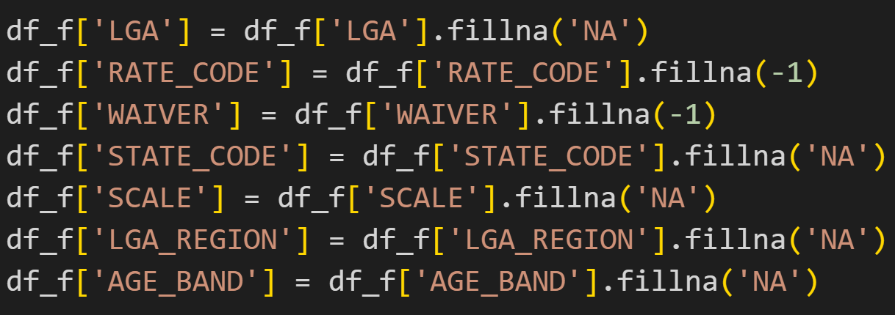
				 *Image 3: NaN/Null Handling in String/Categorical Fields*
				 
			     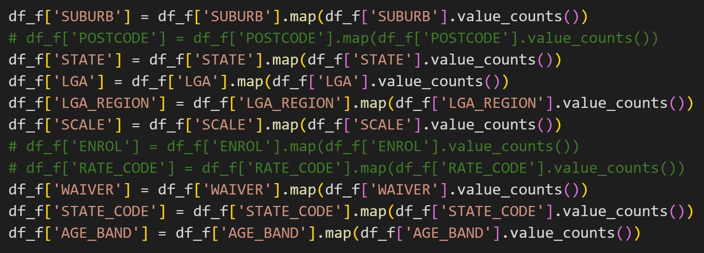
			      *Image 4: String/Categorical Field Mapping to Numeric Values*
			 
			     
			     *Image 5: String/Categorical Field Conversion to Categorical*
			     
			 Once Preprocessing Phase I was complete, the feature dataset was combined with the primary dataset *(containing the target label for training)* and the resulting consolidated dataset was validated to confirm that there are no NaN/Null values in it using: 

		- **Preprocessing Phase II**

			 - **Data Splits:** Post completion of **Preprocessing Phase I** and dataframe consolidation, the processed dataset was split into training, validation, and test datasets as follows:
			 
			     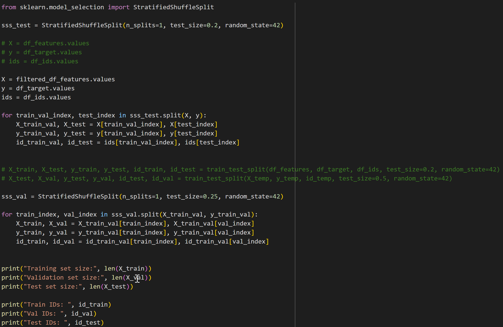
			     *Image 6: Creating Training, Validation, and Test Datasets*
			     
			     The use of *StratifiedShuffleSplit* library ensured the class proportions remained intact in each of the splits/partitions.
							 
			 - **Scaling:** Once the dataset was split into train, validation, and test sets, the training array/dataset was transformed/scaled using the *StandardScaler* library from *sklearn.preprocessing* and the scaled weights/scaler object was applied to the validation, and test sets as follows.
			 
			     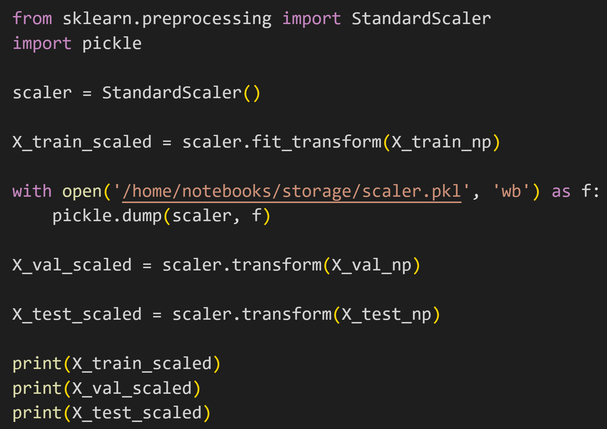
			     *Image 7: Standardizing the Training, Validation, and Test Datasets*
			     
			 - **Intermediate Storage:** As an intermediate step, the scaler object, training, validation, and test datasets along with their respective unique identifiers were stored as *.pkl* files, for downstream consumption by the NN model.
			 
			     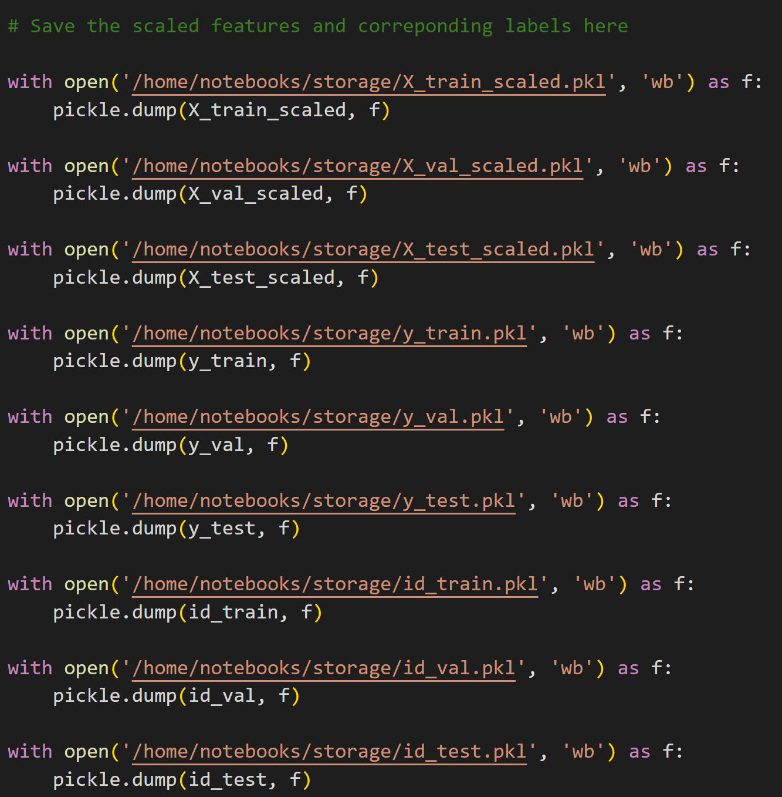
		         *Image 8: Storing Scaler Object, Training, Validation, and Test datasets for downstream consumption*
		         *(NB: Further manipulations and transformations were applied to the datasets to prepare them for input to each layer of the stacked model. Details of these can be found in the code files.)*
		     
	-  **Stacking Ensemble Architecture and Predictions:** This section provides an overview of the overall model architecture and the key layers and parameters in the base and meta-learner models.
	
		- **Level 0 *(Base Learners)*:**
			- A **TensorFlow Sequential Neural Network *(NN)*** with an **Attention** layer, **LSTM *(Long Short-Term Memory)*** layer, **Bidirectional-LSTM** layer, **Dense** layers, and other regularization layers such as **Dropout** layers and **BatchNormalization** layers; was trained on the features from the preprocessed dataset. *(NB: Some of the individual layers, such as LSTM were additionally regularized using in-built parameters such as the bias_regularizer, and the kernel_regularizer)*. As is common practice, regularization was applied to ensure the model would not be prone to over-fitting on the training data, and be able to generalize well to validation and test data. One such NN model architecture is shown in the images below -
			   
			   
			    *Image 9: Custom Attention Layer called in the TensorFlow Neural Network*  
			   		           
			   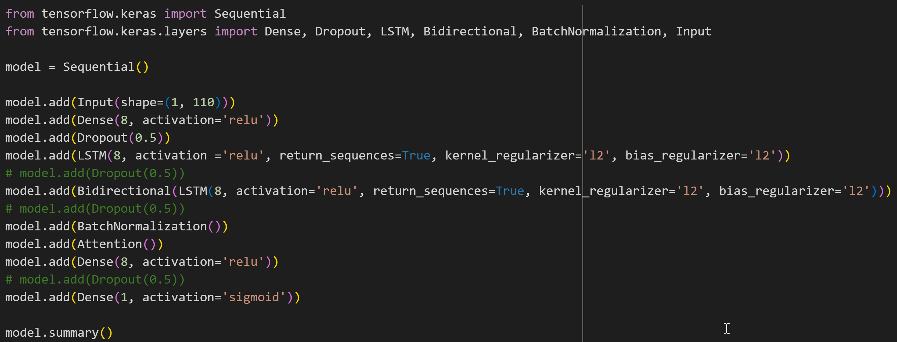
			   *Image 10: TensorFlow Neural Network Architecture*

		     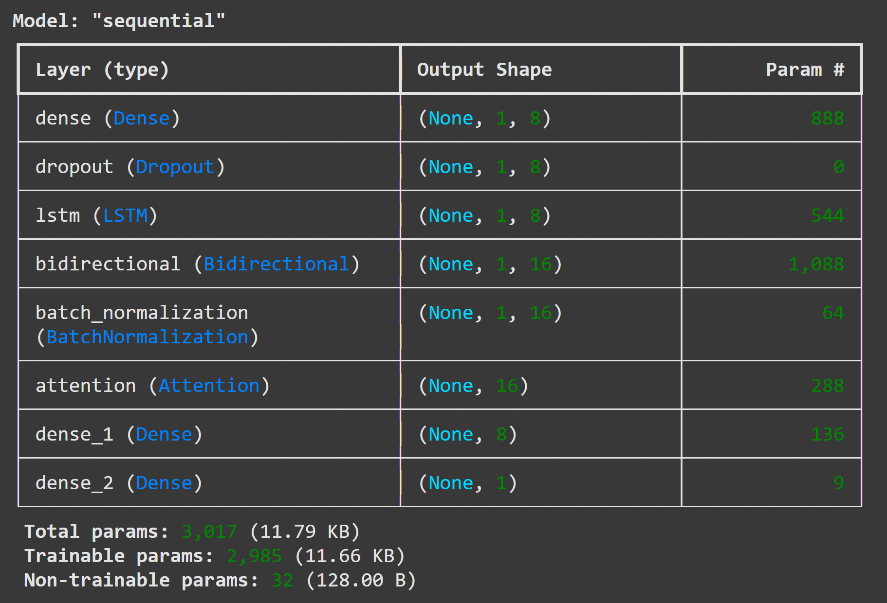
		     *Image 11: TensorFlow Neural Network Layers*
		     
			 The model optimizer was set as follows *(Image 12)*, after which the model was compiled and trained as shown in the code snippets below:
				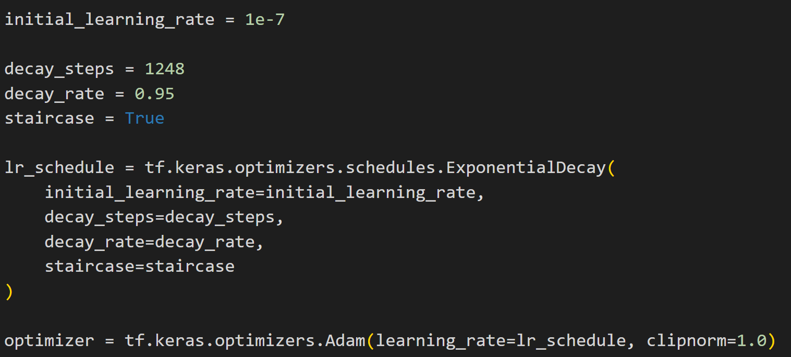
			  *Image 12: TensorFlow Neural Network Optimizer with Exponentially Decaying Learning Rate*

			 
			- The features extracted *(or base predictions made)* by the NN and their corresponding probabilities were then used as input features for an XGBoost *(Extreme Gradient Boosted)* model. An example of one of the XGBoost model architectures, parameters & input feature and data prep. is shown below.
			
			  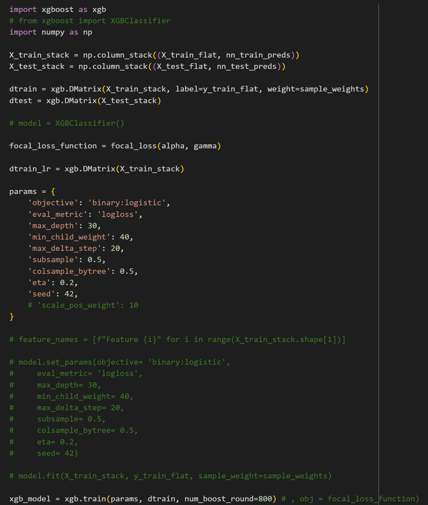
			   *Image 14: Data Preparation and XGBoost Model Architecture*

			Note, in the image above, the *scale_pos_weight*, and *obj = focal_loss_ function* parameters are commented out. However, they played a pivotal role in improving the quality of the XGBoost models' predictions.

            And here is a sample **Confusion Matrix** showing the predictions from the XGBoost model:
            
            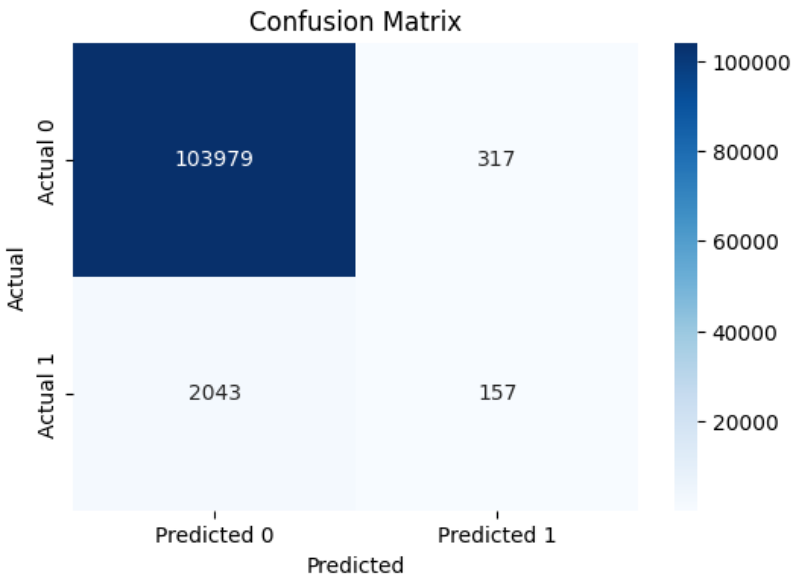
            *Image 15: Sample Confusion Matrix Output from XGBoost Model*			
            
		- **Level 1 *(Meta-Learner)*:**
		
			- Subsequently, the predictions from the NN and XGBoost were combined and used to train a Logistic Regression *(LR)* model.
			
			  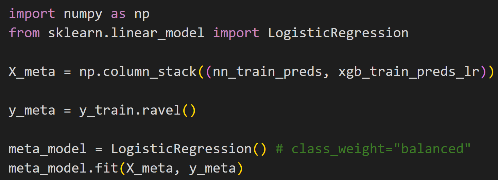
			  *Image 16: Data Preparation and Training the Logistic Regression Model*
						
	-  **Final Prediction and Evaluation:** The overall accuracy *(percentage of correct predictions)* may be an inadequate measurement strategy for imbalanced datasets; since a model may achieve high accuracy by simply predicting the majority class *(non-churn)* most of the time, while failing entirely to identify the minority class *(churners)*. A plethora of metrics were considered for evaluating this model including **Precision**, **Recall**, **ROC-AUC**, and **F1-Score** and whilst the decision was not explicitly made by the business, the models' performance on the **F1-Score *(calculated based on the confusion matrix below)*** and **ROC-AUC** were used as general guidelines to assess the quality of predictions. The final **ROC-AUC** results and **Confusion Matrix** from one of the model iterations is shown below.
       
		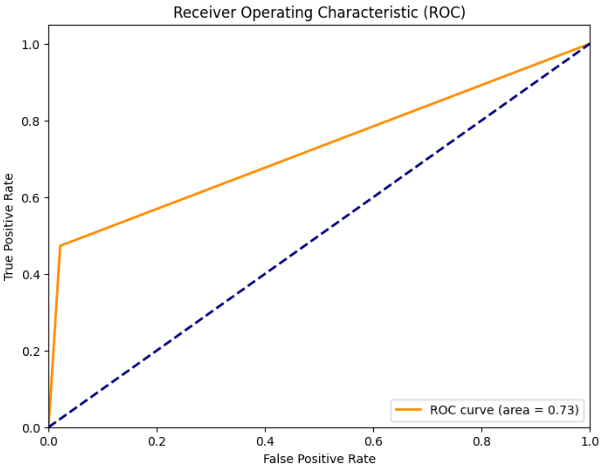
		*Image 17: Example of Final ROC-AUC Output from the Stacked Model*
		

		 
		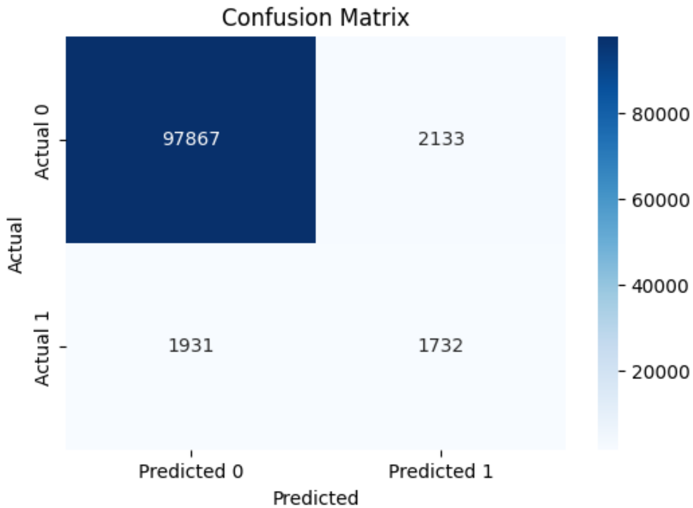
		*Image 18: Example of Final Confusion Matrix Output from the Stacked Model*			

	-  **Performance Improvement Strategy - Data Handling, Algorithmic Approaches, NN Hyperparameter Tuning and Results Evaluation:**  
		
	- **Data Handling:**
	  As mentioned earlier, customer churn datasets are notoriously imbalanced. This poses a significant challenge because standard classification algorithms, optimizing for overall accuracy; tend to perform poorly on the minority class. Several strategies were adopted to mitigate the impact of class imbalance as discussed below.
	
		- **Resampling Techniques:** These techniques directly modify the dataset to make it more balanced for training. At a high level, resampling techniques involve *oversampling* or *downsampling* the dataset based on the class distribution and here are some generic notes about the techniques, the approach applied in this project, and recommendations on approaches that may be applied in future iterations.
		
			- **Oversampling:** Increase the number of minority class instances.
				- *Random Oversampling:* Duplicate existing minority samples. Simple, but prone to overfitting.
				- *SMOTE (Synthetic Minority Over-sampling Technique):* Create *synthetic* minority samples by interpolating between existing minority instances and their nearest neighbors. This can reduce overfitting compared to random oversampling but may potentially introduce noise or blur class boundaries, especially in high dimensions.
				- *ADASYN (Adaptive Synthetic Sampling):* This approach is similar to SMOTE, but adaptively generates more synthetic samples for minority instances that are harder to learn *(i.e., closer to the decision boundary or surrounded by majority instances)*. This may improve boundary learning but can be more sensitive to noise/outliers.
				
			- **Undersampling/Downsampling:** Decrease the number of majority class instances.
				- *Random Undersampling:* This approach involves randomly removing observations from the majority class and is the quickest to implement, however; it may lead to loss of valuable information. Due to the paucity of time, this approach was initially adopted and samples from the majority class  were selected based on an arbitrary threshold of 500,000 rows, as shown below.
				
				  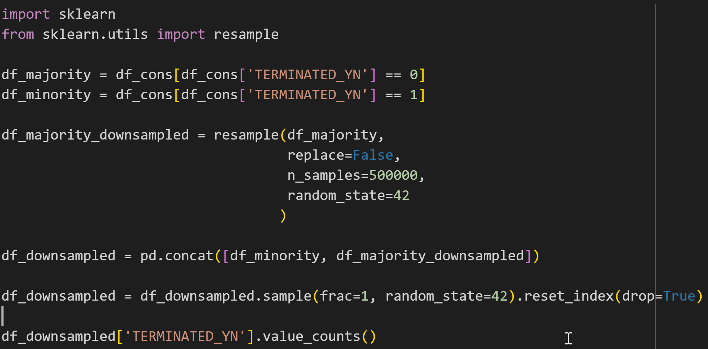
				  *Image 19: Random Downsampling/Undersampling of Majority Class*
								
				- *Tomek Links:* Remove pairs of instances *(one majority, one minority)* that are nearest neighbors, cleaning the class boundary.
				- *Edited Nearest Neighbors (ENN):* Remove majority instances whose class label differs from the majority of their k-nearest neighbors, further cleaning noisy areas.
				
			- **Recommendation:** It is generally good practice to combine oversampling and undersampling techniques, e.g., SMOTE followed by Tomek Links *(SMOTE-Tomek)* or ENN *(SMOTE-ENN)* to first increase the minority representation and then clean potentially noisy areas or overlapping instances.
			
	- **Algorithmic Approaches *(Cost-Sensitive Learning)*:** These approaches, involve *modifying the learning algorithm* to penalize misclassifications of the minority class more heavily than misclassifications of the majority class. This, cost-sensitive learning approach, was applied in experiments via the use of  the *focal loss* function or, alternatively; calculating *custom class weights* and including those as a part of the *weighted binary crossentropy* parameter in the NN. *Custom class weights*, effectively; assign higher weightage to the minority class, whereas the *focal loss* function or *scale pos weight* parameter *(in XGBoost)* achieves the same result via a different mechanism/parameter setting. In effect, these algorithmic approaches directly incorporated the business cost of errors into the model training process. The code implemented for the same in the NN and XGBoost learners is shown in the images below:
	
	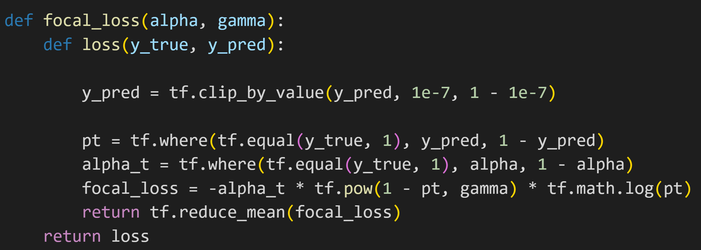
	 *Image 20: Focal Loss Function Defined for TensorFlow Neural Network*

	 
	 *Image 21: Custom Class Weights Calculated for TensorFlow Neural Network*

	 
	 *Image 22: Custom Binary Crossentropy Loss Function Calculated for TensorFlow Neural Network*

	 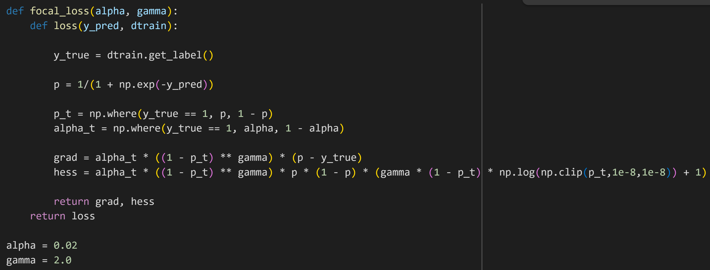
	 *Image 23: Focal Loss Function Defined for XGBoost Model*			

	- **Neural Network Hyperparameters:** Systematic hyperparameter tuning approaches were applied to the NN using a variety of techniques and libraries as outlined below - 

		a. *Optuna* library from the list of *Bayesian Optimization* techniques:
		
		
		*Image 24: TensorFlow Neural Network Hyperparameter Optimization Using the Optuna Library*

		b. *Deap (Distributed Evolutionary Algorithms in Python)* framework:
		   
		  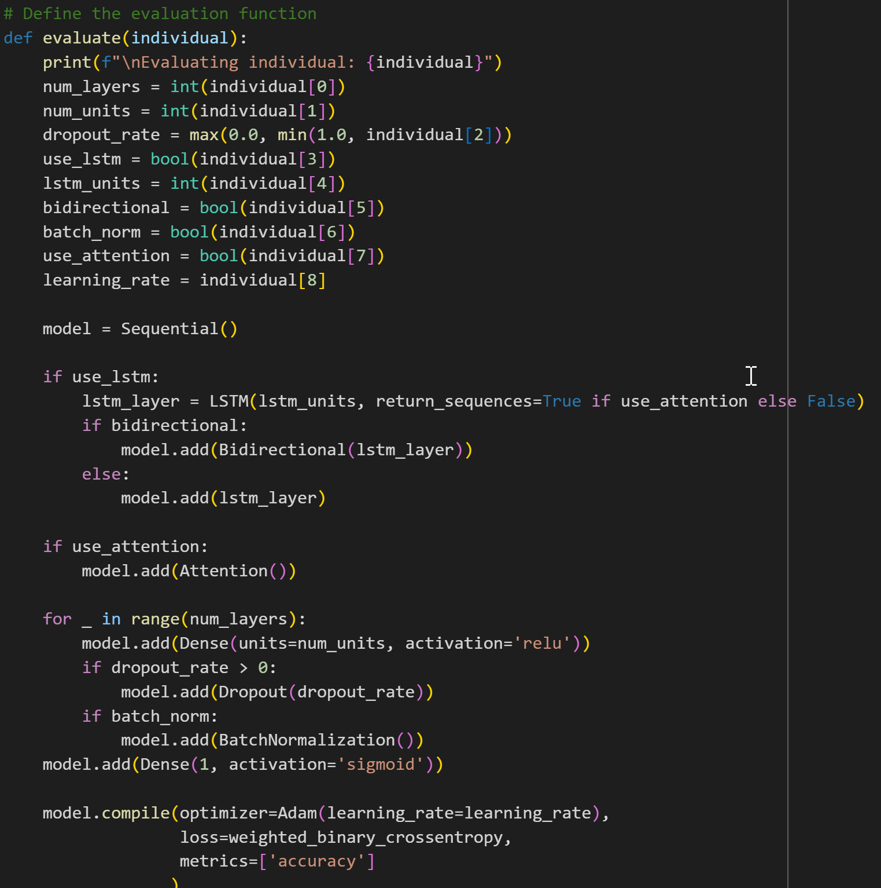
		   *Image 25: TensorFlow Neural Network Hyperparameter Optimization Using Deap*

		c. *Keras Tuner*:	
		   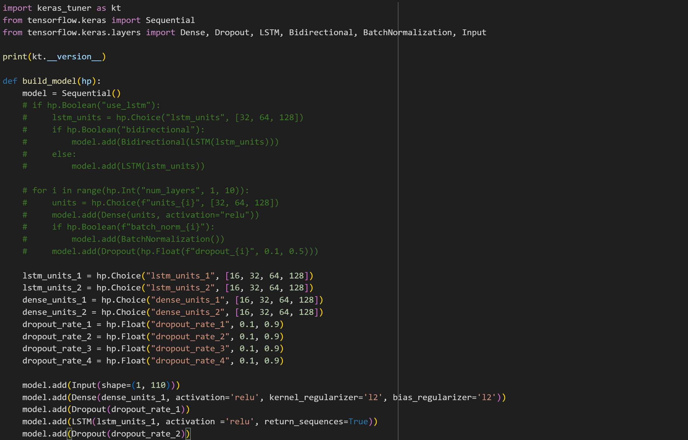
		    *Image 26: TensorFlow Neural Network Hyperparameter Optimization Using Keras Tuner*

	- **Evaluation Metrics:** Since simply relying on accuracy can be misleading in churn scenarios, metrics sensitive to the minority class performance were considered, such as:

		- **Precision, Recall, and F1-Score:** These provided an insight into the positive/minority class prediction quality.
		- **AUC *(Area Under the Curve)*:** The ROC-AUC measure was also observed to understand the overall discrimination between classes.
 
	 Having said this, for future iterations; it is recommended, that **PR-AUC *(Area Under the Precision-Recall Curve)*** be considered which plots **Precision vs. Recall** across thresholds and focuses on the performance of the minority *(positive)* class and is not inflated by a large number of True Negatives. Also, a  measure which takes into account all four **confusion matrix** categories *(True Positive (TP), True Negative (TN), False Positive (FP), False Negative (FN))*, such as **MCC *(Matthews Correlation Coefficient)*** should be considered, since it is a balanced measure suitable even for significant class imbalance. The values of **MCC** range from **-1 to +1**, where +1 is perfect prediction, 0 is random prediction, and -1 is total disagreement. It is a more balanced measure robust to class imbalance as compared to the **F1-Score**.		

3.  **Further Discussion:**   		
	 Currently, both versions of this stacked model exhibit low accuracy as can be inferred from the images in earlier sections. 

	 The chosen stacking architecture *NN -> XGBoost -> Logistic Regression* presents an area for investigation. While stacking commonly leverages diverse base models to improve generalization, the sequential feeding of predictions from one complex model *(NN)* directly into another *(XGBoost)* before reaching the meta-learner *(LR)* is less conventional. This sequential dependency might lead to information loss or redundancy if the intermediate XGBoost model doesn't effectively utilize or transform the NNs' output. Although, despite the aforementioned information loss or redundancy; it was experimentally observed that the XGBoost predictions improved upon the near random-chance *(probability=0.5 or lower)* predictions made by the NN. Furthermore, a simple Logistic Regression meta-learner might struggle to capture the complex, non-linear relationships between the base-learners' predictions, especially if those predictions are highly correlated or if the XGBoost output doesn't provide sufficiently discriminative features for the LR model.

	 The existence of two parallel model versions, differing only in their feature engineering approach *(manual vs. automated)*, provides a valuable diagnostic opportunity. If both models performed *poorly*, it suggests that issues might extend beyond feature engineering alone, potentially involving data quality, preprocessing choices, inadequate hyperparameter tuning, or fundamental limitations of the chosen architecture. However, analyzing the *differences* in how the two models failed *(i.e., the specific types of errors they made)* can yield crucial clues. For instance, if the auto-feature model made significantly more false positives in a specific customer segment compared to the manual-feature model, it might indicate noisy or irrelevant features generated by the automated process for the segment.

	 The observed low accuracy in both model versions could stem from several factors common in churn-prediction projects and potentially exacerbated by the stacking approach:
		1. **Inadequate Data Preprocessing:** Applying encoding or scaling techniques unsuitable for the specific data types or the requirements of the individual models *(NN, XGBoost, LR)* may have hindered performance.
		2. **Suboptimal Feature Engineering/Selection:** The manual features, perhaps lacked coverage of key predictive signals or interactions, while the auto-generated features potentially suffered from noise, redundancy, or irrelevance.
		3. **Lack of Hyperparameter Tuning:** Neural Networks and XGBoost, in particular, have numerous hyperparameters that significantly influence their performance. Although, extensive tuning was applied to the models, this remains an area for further investigation and experimentation.
		4. **Suboptimal Stacking Architecture:** As noted, the specific *NN -> XGBoost -> LR* sequence might not be ideal, since the choice and combination of base and meta-learners heavily influences stacking performance.
		5. **Insufficient Data Quality or Volume:** Poor data quality *(errors, inconsistencies)* or insufficient data volume can limit the ability of any model, especially complex ones like NNs and stacked ensembles, to learn meaningful patterns. Data volume was a consistent limitation identified with the modeling environment, where the environment would run out of RAM *(32 GB)* either during the data pre-processing phase or the NN training phase. Although, attempts were made to handle the 'out-of-memory' issues, by bifurcating the model notebooks into 4 broad brush areas, namely: Preprocessing, Tensor, XGBoost, and Prediction; the data volume limitation persisted. 		
	
    The stacking process itself introduces layers of complexity. Each stage - base model training, generating predictions to serve as input for the meta-learner, and meta-learner training - requires careful validation. Overfitting or significant errors in the base models *(NN and XGBoost)* may have inevitably degraded the quality of the input data provided to the Logistic Regression meta-learner, limiting its potential effectiveness.

    Furthermore, the combination of a NN and XGBoost within the stack necessitates careful preprocessing considerations. NNs typically perform best with features scaled to a specific range *(e.g., 0 to 1 or standardized)*. While tree-based models like XGBoost are generally less sensitive to feature scaling, they require appropriate handling of categorical variables *(e.g., through one-hot or label encoding, although some implementations have native support)*. Applying a single, uniform preprocessing strategy might have inadvertently sub-optimized one or both base models, impacting the overall stack performance.
	
	  Here, a framework for the evaluation of the current preprocessing steps is presented and strategies for improvement are recommended. The focus is on encoding, scaling, missing data, outliers, and class imbalance within the context of the *NN -> XGBoost -> LR* stacking architecture. For each step applied - such as missing value imputation, categorical feature encoding, and numerical feature scaling - the following analysis may be conducted:
        1. **Technique Identification:** Clearly identify the specific method used *(e.g., mean imputation, one-hot encoding, standardscaling)*.
        2. **Data Type Suitability:** Assess if the technique applied was appropriate for the data/feature type it was applied to *(e.g., using mean imputation on categorical data would be incorrect)*. Also, distinguishing between numerical, nominal categorical *(no inherent order)*, and ordinal categorical *(inherent order)* features may help improve the overall model performance.
        3. **Model Appropriateness:** An evaluation of the alignment of the techniques applied with the requirements and sensitivities of the models in the stack *(NN, XGBoost, LR)*.
	        - **Encoding:** Were categorical features encoded in a way that all models could interpret correctly? One-hot encoding, for instance, creates binary columns suitable for NN and LR but increases dimensionality, which might affect XGBoost differently. Label encoding might be acceptable for XGBoost in some cases but could have mislead NN and LR if it was applied to nominal features by implying an ordinal relationship.
	        - **Scaling:** Was the chosen scaling method *(e.g., Standardization vs. MinMaxScaling)* suitable? NNs often benefit significantly from scaled inputs *(e.g., 0-1 range)*, while XGBoost is largely invariant to monotonic scaling but can be sensitive to outliers, which, standardization might amplify. Logistic Regression coefficients are directly influenced by feature scales, making scaling important for interpretability and, potentially; convergence.
	 
	 In summary, the rationale behind each current preprocessing choice must be scrutinized. For example, was *StandardScaler* chosen because the data was assumed to be *Gaussian*, or was a *OneHotEncoder* applied universally without considering *feature cardinality* or potential *ordinal relationships*? Any mismatches between the *technique*, *data characteristics*, and *model needs* could represent potential areas for improvement.
    
    Based on the evaluation, specific, justified recommendations for encoding and scaling should be implemented:
		-  **Encoding:**
			- **Nominal Features:** For categorical features without inherent order *(e.g., 'PaymentMethod', 'Gender')*, **One-Hot Encoding** is generally recommended, especially for models like NN and LR that cannot directly interpret non-numeric data or might misinterpret numerical labels. If cardinality *(number of unique categories)* is very high, dimensionality reduction techniques must be considered post-encoding, target encoding *(with careful cross-validation to prevent leakage)*, or using embedding layers within the NN.
			- **Ordinal Features:** For features with a clear order, **Ordinal Encoding** should be used to preserve this ranking information, which can be valuable for models.
			- **Justification:** The choice must balance preventing the introduction of artificial ordinal relationships *(a risk with label/ordinal encoding on nominal data)* against managing dimensionality *(a potential issue with one-hot encoding on high-cardinality features)*.
		- **Scaling:**
			- **StandardScaler:** Suitable if numerical features approximate a *Gaussian* distribution and models sensitive to scale *(NN, LR)* are used. It centers data around zero with unit variance.
			- **MinMaxScaler:** Scales data to a fixed range *(typically 0 to 1)*. Often preferred for NNs, especially those with activation functions sensitive to input ranges *(like sigmoid or tanh)*. It can also be less sensitive to outliers than StandardScaler.
			- **RobustScaler:** Uses statistics robust to outliers *(like median and interquartile range)* for scaling. Recommended if the data contains significant outliers that might unduly influence StandardScaler.
		 **Recommendation:** Given the presence of an NN, **MinMaxScaler** *(scaling to 0-1)* or **RobustScaler** *(if outliers were present)* is often a good starting point for numerical features feeding the NN. XGBoost is less sensitive, but consistency is needed. Consider if separate scaling steps are warranted for inputs potentially used differently by NN vs. XGBoost, although a single, well-chosen scaler applied consistently is often simpler.
	  
	 Since a **Simple Imputation**, *(mean, median, and mode)* approach was already applied to the dataset, an **Advanced Imputation** approach, *(regression imputation or k-nn imputation)* is recommended, notwithstanding the computational challenges. Also, since missing data itself can be predictive *(e.g., customers who don't provide certain info are more likely to churn)*, creating a 'missing indicator' binary feature is beneficial, and was created in this case as discussed in earlier sections but worth reiterating here.

	 Since the manual dataset was not explicitly tested for *outliers*, which may have disproportionality affected some models and preprocessing steps *(like StandardScaler)*; it may be tested using statistical methods *(e.g., Z-score for Gaussian data, Interquartile Range (IQR) for skewed data)* or visualizations *(box plots)* to identify and remove/transform them to reduce their impact. If legitimate extreme values are detected, using robust scaling methods *(e.g., RobustScaler)* and models *(e.g., XGBoost)* is recommended.
	
	 Finally, feature engineering and selection are critical steps that transform raw data into informative inputs for the model, significantly impacting performance and interpretability. This final section compares the extant manual and automated feature approaches and proposes strategies for improvement and selection. Since, fundamentally, two model versions were created *(albeit, not fully completed due to delivery time constraints and competing priorities)*, a comparison between manually engineered and automatically generated features may be conducted, especially given that both models yielded *poor* performance. Although, manual feature engineering,  allowed incorporation of domain knowledge about the churn drivers *(e.g., specific usage thresholds, sequences of support interactions, etc.)*, this was a highly time-consuming and labor-intensive task. The quality and coverage were also limited by individual expertise, creativity, and patience; and thus potentially crucial variable interactions might have been missed. At this stage, a key question that remains to be explored is whether the current manual features adequately capture known dynamic aspects of churn, such as changes in behavior over time.
	 
	 In contrast, the automated feature engineering approach, was significantly faster, less labor intensive, and systematically explored a vast number of feature combinations and transformations *(e.g., aggregations across related tables, interaction terms)*, that may have been overlooked during manual feature engineering; and lead to improved predictive performance by uncovering novel patterns. Moreover, in general; this process is more repeatable and consistent. However, a challenge with automated feature engineering is that it may be prone to generating a large number of irrelevant or redundant features, necessitating aggressive feature selection. In consonance with the challenges faced during manual feature engineering, the automated engineering approach was fraught with challenges of its own in the form of the effectiveness of the generated features and the possibility of missing nuances requiring deep domain expertise.
  
    Thus, as a next step, it is recommended, that further analysis be conducted on the *types* of errors made by each model. If the auto-feature model struggled in areas where domain knowledge suggests specific manual features should excel *(or vice-versa)*, it points towards specific feature deficiencies. Also, manual and automated approaches need not be mutually exclusive; and a hybrid strategy can be highly effective.

    In general, regardless of the generation method, the feature quality can be enhanced by focusing on dynamics and changes in customer behavior, such as, features representing trends, changes, or recency *(e.g., 'usage change last month vs. previous 3 months', 'days since last login')*, or those quantifying engagement   patterns *(e.g., session duration variance, navigation paths in member portal)*, and polynomial features *(e.g., 'support calls * average call duration', 'monthly charges/tenure')*; while also leveraging domain knowledge such as known business rules or customer lifecycle stages.

4. **Next Steps:** The following steps are recommended to systematically address the performance of the existing solutions. Foundational issues are addressed first followed by proposed architectural modifications: 

	-  **Baseline Re-evaluation and Setup:**
		- Establish a reliable baseline performance for *both* extant models *(manual and auto-feature)* using the current architecture.
		- Implement a rigorous evaluation framework using **nested cross-validation *(CV)****.
		- Select **PR-AUC** or **MCC** as the primary evaluation metric and track **Precision** and **Recall** separately.
		- Ensure there is no data leakage in the current implementation *(especially around feature generation and CV for stacking)*.
		- Set up experiment tracking *(e.g. using MLflow)* to log all subsequent experiments, parameters, metrics, and artefacts.

	-  **Imbalance Handling Strategy:**
		- Experiment further with **cost-sensitive learning** by tuning **scale_pos_weight** in **XGBoost** and **class_weight** in **Logistic Regression** or the **Neural Network *(NN)*** components. The ultimate choice of weights will be based on the estimated **business costs** of **FPs vs. FNs**.
		- Separately, experiment with resampling techniques integrated *within* a **CV** loop:
			- Implement **SMOTE-ENN** instead of **SMOTE** or **ADASYN**.
			- Evaluate based on the chosen primary metric **PR-AUC** or **MCC**.
		- Select the most effective imbalance handling strategy *(cost-sensitive learning or the best resampling method)* for subsequent steps.
		
	-  **Systematic Hyperparameter Tuning:**
		- Using the chosen imbalance strategy, perform systematic hyperparameter tuning for the base models *(NN, XGBoost)* and the meta-learner *(Logistic Regression)* for both manual and auto-feature versions.
		- Employ Bayesian optimization *(e.g., Optuna, Hyperopt)* with nested CV.
		- Tune base models first to optimize their individual generalization performance, then generate out-of-fold predictions, and finally tune the meta-learner on these predictions.
		- Utilize *early stopping* where applicable to speed up the process.
		
	-  **Feature Review, Selection and Engineering:**
		- Analyze the importance of extant features *(manual and auto)* using PFI and/or SHAP values on the tuned model from Step 3 *(above)*.
		- Implement robust feature selection *(RFECV or a PFI-based iterative approach)* integrated within the CV loop to reduce noise and dimensionality. Compare performance with and without explicit selection.
		- Based on error analysis, and feature importance results, consider targeted manual feature engineering to capture potentially missing signals *(trend-based features, interaction terms)*.

	-  **Architecture Exploration:**
		- If the performance of the models after Step 1-4 *(above)* remains unsatisfactory, experiment with alternative stacking architectures.
		- Introduce diversity in base models: Replace or add models like LightGBM, CatBoost, or Random Forest alongside or instead of NN/XGBoost. Also, consider training base models in parallel rather than sequentially.
		- Experiment with alternative meta-learners: Try a regularized linear model *(Ridge)*, a linear Support Vector Machine *(SVM)*, or even a carefully tuned *(highly regularized)* gradient boosting model.
		- Retune hyperparameters for any new architecture components.
		
	-  **Error Analysis & Decision Threshold Tuning:**
		- Continuously analyze misclassifications *(FPs and FNs)* throughout the process using manual inspection and XAI tools *(SHAP, LIME)* to understand model weaknesses and guide feature engineering or architecture choices.
		- Once the final model architecture and hyperparameters are selected, determine the optimal probability threshold for classifying churn vs. non-churn **based on the business costs** of FP and FN errors, using the Precision-Recall curve or direct cost calculation. Evaluate final performance at this chosen threshold.  

		 Addressing foundational issues such as class imbalance and hyperparameter tuning often provides substantial performance improvements before requiring major changes to the model architecture or feature set. Therefore, these steps have been prioritized here.
		 
	 -  **Solution Hosting:**
		 - If this project/model is to be enhanced and used in the future, the following Git structure is recommended to align with best practice at the time of writing this document.
		 
